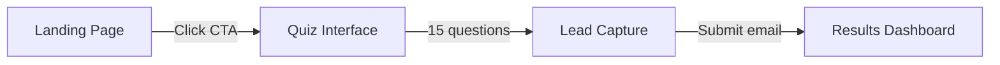

# Scorecard Website — Design System

> **Source:** Stitch project "scorecard website" (`projects/1127628128527952630`)
> **Design Direction:** Glassmorphic Modern Vista
> **Device:** Desktop (1280px)
> **Inspiration:** Apple Vision Pro UI, Zaha Hadid Architects

---

## Product Overview

A high-conversion **assessment landing page and quiz funnel** for property managers. It combines cinematic architectural visuals with glassmorphic UI to communicate the premium nature of AI automation.

**Target audience:** Property management agency owners/executives who want measurable insights into their operational efficiency and fear being left behind by technology.

---

## User Flow



1. **Landing Page** → Cinematic hook + value proposition → CTA: "Answer 15 questions to find out"
2. **Quiz Interface** → 15 frictionless questions with progress bar → auto-advances on selection
3. **Lead Capture** → Email gate before revealing results → CTA: "Reveal My Score"
4. **Results Dashboard** → Personalized automation score, peer comparison, actionable roadmap → CTA: "Book a Strategy Call"

---

## Screens

### 1. Landing Page
**Purpose:** Sell the assessment and capture attention instantly.

| Property | Value |
|---|---|
| Layout | Full-screen background image, centered glassmorphic card (`max-width: 800px`) |
| Background | High-res brutalist/modernist concrete home in misty pine forest. Subtle slow pan (scale 1.0 → 1.05 over 30s) |
| Glass Card | `800px` wide, `24px` radius, frosted glass bg, `blur(24px)`, 1px inset top/left border, `48px` padding |

**Content:**
- **Headline:** "Automation is going to do for this generation what electricity did in the 20th century. Your competitors are already using it."
  - `Cormorant Garamond`, 600, `56px`, line-height `1.1`
- **Subheadline:** "The question isn't whether AI will change property management. It already is. This assessment tells you where you stand — and what it's costing you to wait."
  - `Plus Jakarta Sans`, 400, `18px`, muted gray
- **Secondary line:** "Find out how automated your operation really is — and what your competitors are doing that you're not. Free. 3 minutes. Immediate results."
  - `14px`, center-aligned
- **Primary CTA:** "ANSWER 15 QUESTIONS TO FIND OUT"
  - Gold background, white text, `12px` radius, `64px` height, full-width

**Animations:**
- Load: Background blurred → sharp fade (1.5s), text fades in sequence (Headline → Sub → CTA)
- Hover CTA: brightness +110%, `translateY(-2px)`, shadow intensifies
- Click CTA: card scales to `0.95`, fades out, background blur increases to `48px`

---

### 2. Quiz Interface
**Purpose:** Keep user engaged through 15 questions with minimal drop-off.

| Property | Value |
|---|---|
| Layout | Centered glass card (`600px` wide), top progress bar |
| Progress bar | 4px high, screen edge, glass track, gold fill |

**Content:**
- **Counter:** "Question 3 of 15" — `12px`, uppercase, muted gray
- **Question text:** e.g. "How do you currently handle after-hours maintenance requests?"
  - `Cormorant Garamond`, `36px`
- **Options:** Vertical stack of 4 answer buttons, glass bg, left-aligned text, `12px` radius

**Interactions:**
- Hover option: faint gold tint `rgba(212, 175, 55, 0.1)`, gold border
- Click option: Current card slides left (`-40px`) + fades out, next card slides in from right (`+40px`) + fades in. Duration `0.3s` ease-out

---

### 3. Lead Capture
**Purpose:** Gate the results behind an email capture.

| Property | Value |
|---|---|
| Layout | Centered glass card (same system) |

**Content:**
- **Headline:** "Your analysis is ready." — `Cormorant Garamond`, `48px`
- **Value prop:** "Enter your email to see your automation score, peer comparison, and custom 90-day implementation roadmap."
- **Email input:** `56px` height, dark bg `rgba(0,0,0,0.4)`, glass border, white text
- **Submit CTA:** "REVEAL MY SCORE" — Solid gold button
- **Trust signal:** "We respect your privacy. Secure 256-bit encryption."

**States:**
- Error: red 1px border, inline text "Please enter a valid work email."
- Focus: border glows gold

---

### 4. Results Dashboard
**Purpose:** Deliver the "Aha!" moment and pitch a consultation.

| Property | Value |
|---|---|
| Layout | 2-column glassmorphic grid (Left: Score/Summary, Right: Breakdown/Action) |

**Content:**
- **Score Ring:** Large SVG circular progress gauge (0-100), gold stroke, large center text
- **Verdict:** "You are in the bottom 20% of modern property managers. You are leaving an estimated $120,000 on the table annually."
- **Comparison chart:** Horizontal bar charts comparing user vs "Industry Leaders" (Leader avg: 92%, 88%, 95%)
- **Insight text:** "The gap between you and industry leaders is widening. A custom 90-day implementation roadmap can close it."
- **Action CTA:** "Book a Strategy Call to Automate Your Operations" — fixed at bottom of right column

**Animations:**
- Load: Score ring animates 0 → actual score over 1.5s, chart bars slide in from left

---

## Design System

### Color Palette

| Token | Value | Usage |
|---|---|---|
| `--color-primary` | `#D4AF37` (Metallic Gold) | Buttons, progress bars, highlights |
| `--color-background` | `#0A0F0D` (Deep Obsidian) | Base behind background image |
| `--color-glass` | `rgba(255, 255, 255, 0.08)` | Frosted glass cards |
| `--color-glass-border` | `rgba(255, 255, 255, 0.15)` | Card borders, hover states |
| `--color-text` | `#FFFFFF` (Pure White) | Headlines, primary copy |
| `--color-muted` | `#9CA3AF` (Cool Gray) | Subheadlines, secondary text |
| `--color-accent` | `#10B981` (Emerald) | Success states, high-score indicators |

### Typography

| Role | Font | Weight | Size | Notes |
|---|---|---|---|---|
| Headings | Cormorant Garamond | 600 | 48–64px | Cinematic, authoritative |
| Body | Plus Jakarta Sans | 400 | 18px | Crisp, legible |
| Small text | Plus Jakarta Sans | 500 | 14px | `letter-spacing: 0.05em` |
| Buttons | Plus Jakarta Sans | 600 | 16px | Uppercase, `letter-spacing: 0.1em` |

### Design Tokens (CSS)

```css
:root {
  --color-primary: #D4AF37;
  --color-background: #0A0F0D;
  --color-glass: rgba(255, 255, 255, 0.08);
  --color-glass-border: rgba(255, 255, 255, 0.15);
  --color-text: #FFFFFF;
  --color-muted: #9CA3AF;
  --color-accent: #10B981;
  --font-heading: 'Cormorant Garamond', serif;
  --font-body: 'Plus Jakarta Sans', sans-serif;
  --radius-lg: 24px;
  --radius-md: 12px;
  --shadow-glass: 0 32px 64px -16px rgba(0, 0, 0, 0.4);
  --blur-glass: blur(24px);
}
```

### Core Visual Effects

- **Glassmorphism:** `backdrop-filter: blur(24px)` + subtle 1px white-transparent inset borders
- **Shadows:** Deep, soft, background-tinted → `rgba(0,0,0,0.4)`
- **Border radius:** `24px` (cards), `12px` (buttons/inputs)

---

## Screen Groups & Variants

The Stitch project contains **3 screen groups**, each with design variants:

| Group | Visible Screens | Notes |
|---|---|---|
| **Group 1** (Primary) | Landing Page, Quiz Interface, Lead Capture, Results Dashboard | Main design used above |
| **Group 2** | Landing Page, Quiz Interface, Lead Capture, Results Dashboard, Assessment Interface | Alternate variants |
| **Group 3** | Landing Page, Quiz Interface, Lead Capture, Results Dashboard | Additional variants |

Each group iterates on the same 4-screen funnel with visual variations.

---

## Build Guide

**Recommended Stack:** HTML + Tailwind CSS v3

**Build Order:**
1. **Global CSS & Background Engine** — Full-screen fixed background, overlay, CSS variables for glassmorphism
2. **Landing Page** — Primary glass card, blur, inset borders, typographic hierarchy (establishes core UI)
3. **Quiz Interface** — Reusable question card component, state transition animations
4. **Lead Capture & Results** — Reuse card components, build form + SVG score ring visualization

---

## Stitch Project Reference

| Field | Value |
|---|---|
| Project ID | `1127628128527952630` |
| Project Name | `projects/1127628128527952630` |
| Title | scorecard website |
| Visibility | Private |
| Device Type | Desktop |
| Design Theme Font | Space Grotesk |
| Design Theme Color Mode | Light |
| Custom Accent Color | `#fa3869` |
| Roundness | Round 4 |
| Total Screen Instances | 38 |
